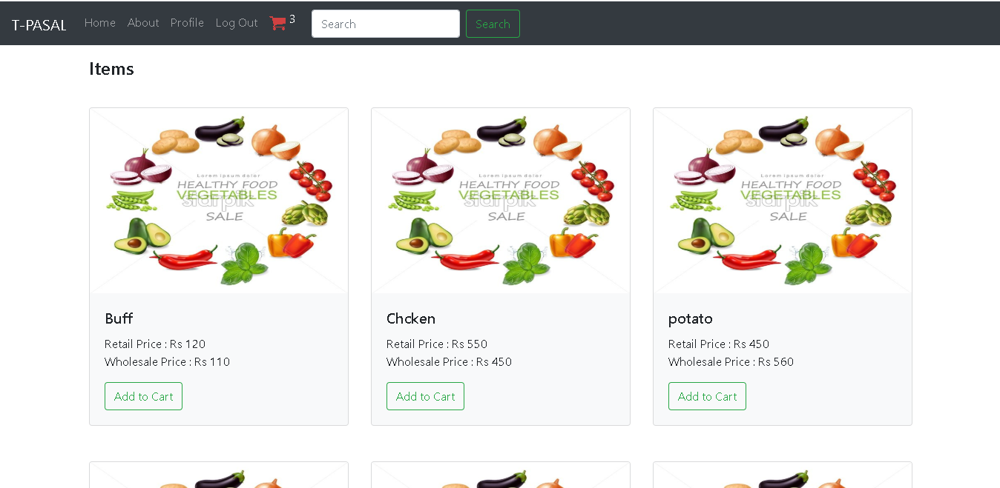
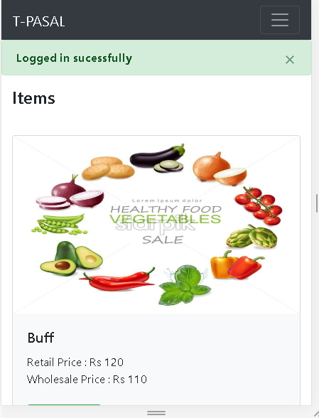
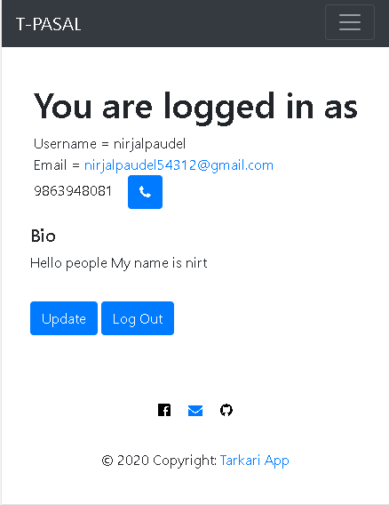
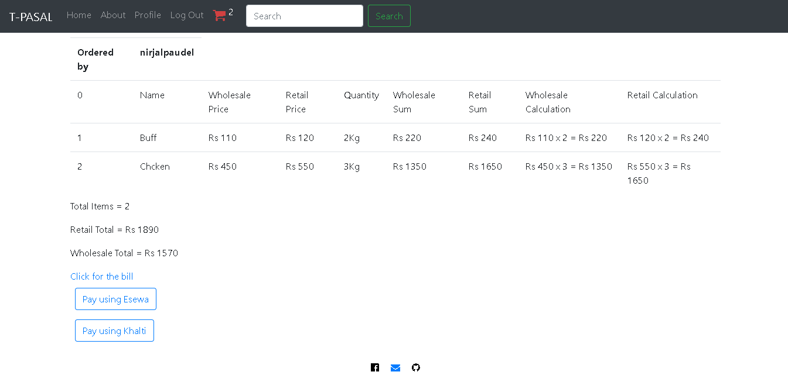

# eTARKARIPASAL
>A sample ecommerce-site for my portfolio<br>
>Deployed (https://tarkariapp.herokuapp.com/)<br>
>Try not to re-deploy it but you can see the code

<br>

<br>
<br>


# Installation:
OSX and linux
```terminal
sudo apt install git 
sudo apt install python3
sudo apt get python3-pip
pip3 install pipenv
git clone https://github.com/n1rjal/eTARKARIPASAL.git
cd eTARKARIPASAL
python3 manage.py runserver
```

Windows
Install git, python3.8 or higher, pip from the internet
```terminal
pip install pipenv
git clone https://github.com/n1rjal/eTARKARIPASAL.git
cd eTARKARIPASAL
python3 manage.py runserver
```

# Building Blocks
* [Django](https://github.com/django/django)
* HTML5
* [Bootstrap](https://github.com/twbs/bootstrap)

# Meta
> Nirjal Paudel :(nirjalpaudel54312@gmail.com)
